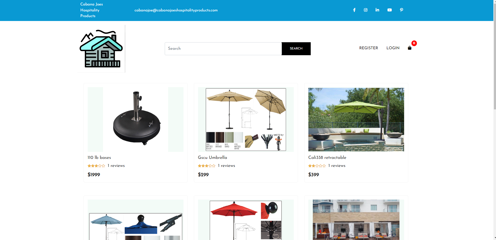
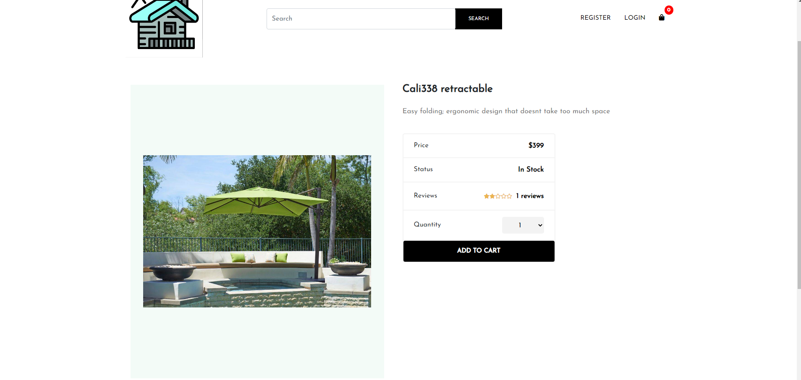

# MERN-Stack

## Purpose

The goal of this project is to modify the functionality of the Cabana Joe's Hospitality Products webpage. Currently, the Website has no on-line store functionality and is coming soon. Our group took on the development of an online store with complete functionality.
<br />
<br />
The client is able to purchase products from our newly designed website as well as receive confirmation of their purchase. When purchasing a new product, the client will also be prompted to enter payment information. 

## Installation

To run this project, install it locally using npm:

```
$ npm install
$ npm start
```

## User Information

Register your new credentials in order to use entire store

## Built With

- [HTML](https://developer.mozilla.org/en-US/docs/Learn/Getting_started_with_the_web/HTML_basics)
- [Javascript](https://www.javascript.com/)
- [node.js](https://nodejs.org/en/)
- [React](https://reactjs.org/)

## Website

https://github.com/EPW80/MERN-Stack

## Deployment

https://client-side-cabana-joe-hp.herokuapp.com/

## Mock-up





## Questions

for more information or if you have a question:
<br>
email [Erik Williams](erikparrawilliams@gmail.com).


## Contribution:

Erik Williams

## License

MIT License

#### ©️2022
